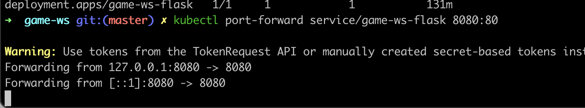
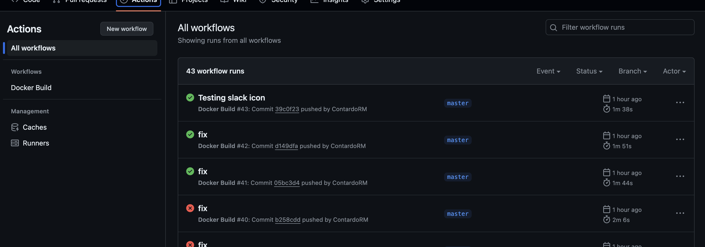
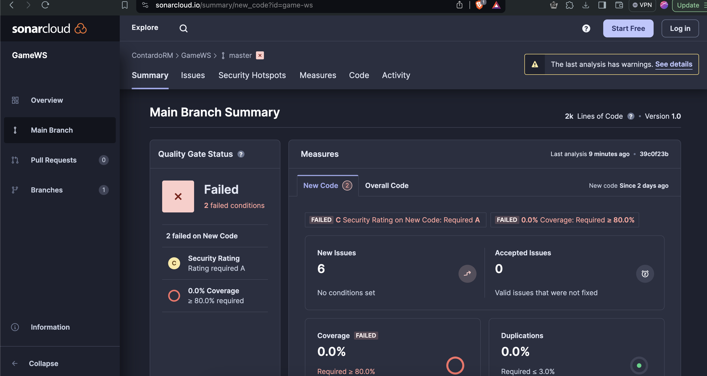
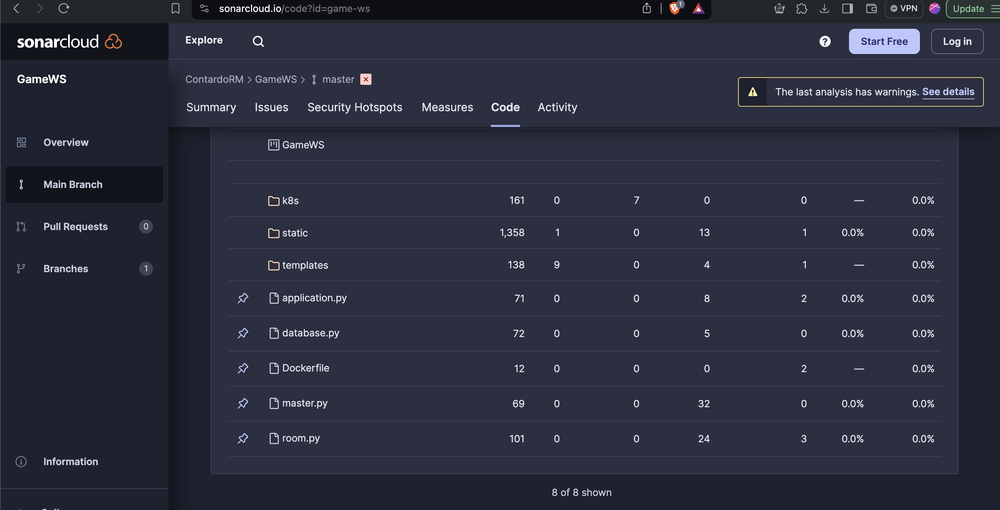
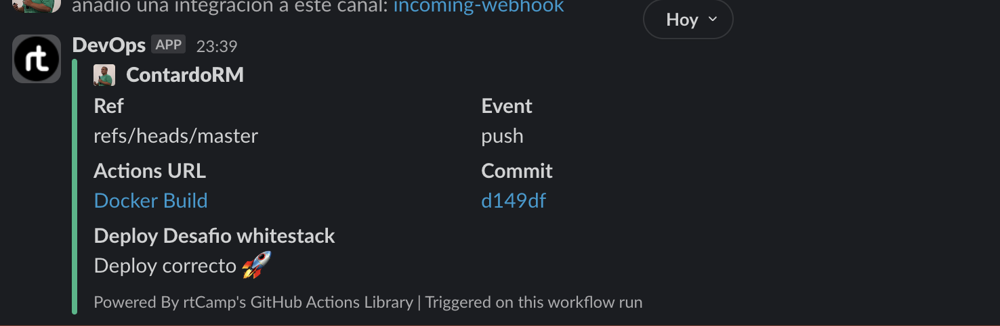
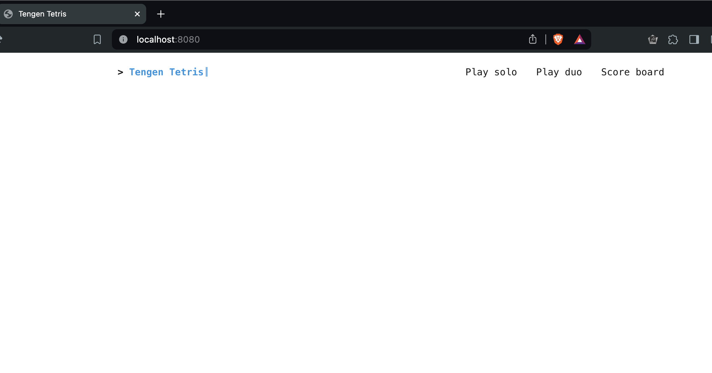

# Desafío Whitestack

Para este challenge se realiza un fork del [Proyecto](https://github.com/aitorperezzz/tengen-tetris/tree/master), luego de eso se realizan los siguiente pasos.


## Imagen Docker y Pruebas locales

Se levanta el proyecto con el siguiente Docker file en donde tenemos la capacidad de inyectar mediante variables de entorno FLASK_HOST y FLASK_PORT

```bash
    FROM python:3-slim

    WORKDIR /app

    COPY . /app

    # Instalar dependencias y limpiar archivos innecesarios
    RUN apt-get update && \
        apt-get install -y --no-install-recommends python3-pip && \
        pip3 install --no-cache-dir flask flask_socketio gevent-websocket && \
        apt-get clean && \
        rm -rf /var/lib/apt/lists/*

    ENV FLASK_HOST=0.0.0.0
    ENV FLASK_PORT=8080

    EXPOSE 8080

    CMD ["python3", "application.py"]
```

## Manifiestos Kubernetes (k8s)

Se crean los siguiente manifiestos, en donde el deployment usa como imagen la imagen alojada en dockerhub contardorm/desafio-ws:latest

- deployment.yaml
```bash
      apiVersion: apps/v1
      kind: Deployment
      metadata:
        name: game-ws
      spec:
        replicas: 1
        selector:
          matchLabels:
            app: game-ws
        template:
          metadata:
            labels:
              app: game-ws
          spec:
            containers:
            - name: game-ws
              image: contardorm/desafio-ws:latest
              imagePullPolicy: Always 
              resources:
                limits:
                  cpu: 1
                  memory: 500Mi
              ports:
              - containerPort: 8080
```
- service.yaml
```bash
        apiVersion: v1
        kind: Service
        metadata:
          name: game-ws-service
        spec:
          selector:
            app: game-ws
          ports:
            - protocol: TCP
              port: 80
              targetPort: 8080
          type: NodePort
```
## Helm chart 
Se crear un chart asociado al servicio  en donde tenemos la capacidad de cambiar parametros asociados al contenedor puertos e ip del servicio
- values.yaml
```bash
image:
  repository: contardorm/game-ws
  tag: latest
  pullPolicy: Always

service:
  type: NodePort
  port: 80

replicaCount: 1

flaskHost: 0.0.0.0
flaskPort: 8080
```
- Chart.yaml
En el archivo chart.yaml podemos cambiar la versión del servicio para que sea desplegado sobre el cluster de esta forma cada vez que realicemos un cambio a nivel de código podemos desencadenar que se actualice el servicio a nivel de helm.
```bash
version: 0.1.11
```

## Despliegue sobre k8s

Se prueban desplegando de forma independiente los archivos deployment y service, luego mediante Helm directamente por consola.

## Acceso a la Aplicación desde el Cluster
Se usa la el servicio de port-formard para consumir el servicio en la red local del namespace
```bash
kubectl port-forward service/game-ws-flask 8080:80
```



## CICD 
Se realiza la integración con github action para habilitar tanto la compilación, analisis estatico como Despliegue.


## Integración con Sonarcloud
Se agrega la integración con sonarcloud para una analisis de codigo estatico del servicio en donde se identifica alertas como por ejemplo agregar limites a los manifiestos de deployment.




## Deploy del servicio
Se habilita la integración para un deploy mediante kubectl y helm
```bash
      - name: Run kubectl apply
        run: |
          kubectl apply -f k8s/
          kubectl get po
      - name: Deploy with Helm
        env:
          KUBE_CONFIG_DATA: ${{ secrets.KUBE_CONFIG_DATA }}
        run: |
          helm upgrade game-ws ./k8s/helm/
```

## Integración con Slack
Se habilita la integración con slack para realizar notificaciones en caso de exito o fracaso al momento de ejecutar la CI en github action




## Ejecutar el servicio de forma local

1. crear un nuevo directorio 
2. realizar clone de este repositorio `git clone`
3. compilar la imagen del contenedor en la raiz del proyecto
```bash
docker build --no-cache -t imagendesafiows .
```
4. ejecutar la imagen creada en donde el flag -p es el puerto para la interacción del host y el contenedor y el nombre de la imagendesafiows previamente creada
```bash
docker run --name desafiows --rm -p 8080:8080 imagendesafiows
```
5. Luego vamos a un navedador y vamosa localhost:8080


## Fuera de scope
- Agregar la actualización automatica del archivo chart al momento de deployar el servicio
- Fixear todas las alertas generadas por sonarcloud
- Usar tag en github para vincular los deployment
- Agregar persistencia para la data generada en el servicio durante los juegos